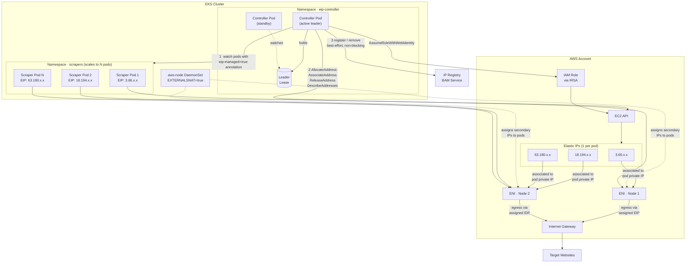

# eip-controller Helm Chart

Helm chart for deploying the EIP Controller — a Kubernetes operator that assigns a dedicated AWS Elastic IP to each annotated scraper pod on EKS.

## Architecture



**Key design points at scale:**
- Two controller replicas with leader election — only the active leader reconciles; the standby takes over within seconds if the leader crashes
- Each scraper pod gets its own EIP mapped at the ENI level — traffic egresses from that specific public IP with no NAT
- A Kubernetes finalizer holds pods in `Terminating` until their EIP is cleanly released — zero leaked IPs even during node failures
- An orphan reconciler runs every 5 minutes to catch any EIPs that slipped through (e.g. controller crash between allocate and annotate)
- BAM notifications are best-effort — EIP assignment never blocks on registry availability

## Install

```bash
helm repo add eip-controller https://ronakforcast.github.io/eip-controller-helm
helm repo update
helm install eip-controller eip-controller/eip-controller \
  --namespace eip-controller --create-namespace \
  --set aws.region=us-east-1 \
  --set aws.clusterName=my-cluster \
  --set bam.registerURL=http://bam-service.internal/api/v1/register \
  --set bam.removeURL=http://bam-service.internal/api/v1/remove \
  --set serviceAccount.annotations."eks\.amazonaws\.com/role-arn"=arn:aws:iam::123456789012:role/EIPController
```

## How it works

1. Label a pod with `eip-controller.io/eip-managed: "true"`
2. The controller detects the pod, allocates an EIP from the AWS pool, and associates it to the pod's private IP on its ENI
3. The EIP is written back as a pod annotation (`eip-controller.io/eip-public-ip`)
4. On pod deletion the EIP is disassociated and released — no orphaned IPs

## Prerequisites

| Requirement | Details |
|-------------|---------|
| EKS cluster | VPC CNI with `EXTERNALSNAT=true` on the aws-node DaemonSet |
| Two node groups | **Scraper nodes** in public subnets (IGW route, labeled `node.kubernetes.io/scraper=true`); **system nodes** in private subnets (NAT Gateway route) for the controller |
| IRSA role | IAM role attached to the controller service account — see required permissions below |
| EIP quota | Default AWS quota is 5 per region — request an increase before deploying at scale |
| IMDSv2 hop limit | Set to `2` on all nodes (default is `1`, which blocks pod-level IMDS access) |

### Required IAM permissions

```json
{
  "Version": "2012-10-17",
  "Statement": [{
    "Effect": "Allow",
    "Action": [
      "ec2:AllocateAddress",
      "ec2:AssociateAddress",
      "ec2:DisassociateAddress",
      "ec2:ReleaseAddress",
      "ec2:DescribeAddresses",
      "ec2:DescribeNetworkInterfaces",
      "ec2:DescribeInstances",
      "ec2:CreateTags"
    ],
    "Resource": "*"
  }]
}
```

> `ec2:CreateTags` is required — the controller tags every allocated EIP with the cluster name and pod identity for scoped cleanup.

## Cluster Setup

Complete these steps **before** running `helm install`. Each step is required — skipping any one will prevent the controller from working.

---

### Step 1 — VPC: ensure both public and private subnets exist

The cluster VPC must have:
- **Public subnets** with route `0.0.0.0/0 → Internet Gateway` — for scraper nodes
- **Private subnets** with route `0.0.0.0/0 → NAT Gateway` — for the controller and system workloads

If your cluster was created with `eksctl` (recommended), both subnet types are created automatically. Verify:

```bash
aws ec2 describe-subnets \
  --filters "Name=vpc-id,Values=<your-vpc-id>" \
  --query 'Subnets[*].{Name:Tags[?Key==`Name`].Value|[0],Public:MapPublicIpOnLaunch,AZ:AvailabilityZone}' \
  --output table
```

---

### Step 2 — Two node groups

You need two separate node groups. **Do not run the controller on scraper nodes** — doing so creates a circular dependency where the controller cannot reach AWS STS to obtain credentials.

**Scraper node group** (public subnets)

```bash
eksctl create nodegroup \
  --cluster <cluster-name> \
  --region <region> \
  --name scraper-ng \
  --node-type m5.large \
  --nodes 2 \
  --node-labels "node.kubernetes.io/scraper=true" \
  --node-taints "node.kubernetes.io/scraper=true:NoSchedule" \
  --subnet-ids <public-subnet-1>,<public-subnet-2>
```

**System node group** (private subnets — for the controller)

```bash
eksctl create nodegroup \
  --cluster <cluster-name> \
  --region <region> \
  --name system-ng \
  --node-type m5.large \
  --nodes 1 \
  --node-private-networking \
  --subnet-ids <private-subnet-1>,<private-subnet-2>
```

> **Why two node groups?** Scraper nodes are in public subnets with `EXTERNALSNAT=true`, which disables NAT for pod traffic. A pod on a scraper node with no EIP assigned has no internet path — including the controller itself, which needs to reach `sts.amazonaws.com` for IRSA credentials. The controller must run on private subnet nodes where a NAT Gateway provides internet access regardless of EXTERNALSNAT.

---

### Step 3 — IMDSv2 hop limit = 2

The default hop limit of 1 prevents pods from reaching EC2 instance metadata. Set it to 2 on **all nodes** — both node groups.

Check current value:

```bash
aws ec2 describe-instances \
  --filters "Name=tag:eks:cluster-name,Values=<cluster-name>" \
  --query 'Reservations[*].Instances[*].{ID:InstanceId,HopLimit:MetadataOptions.HttpPutResponseHopLimit}' \
  --output table
```

If any node shows `1`, update it:

```bash
aws ec2 modify-instance-metadata-options \
  --instance-id <instance-id> \
  --http-put-response-hop-limit 2 \
  --http-endpoint enabled
```

> Set this on the launch template for new nodes so it applies automatically to replacements and scale-out events.

---

### Step 4 — EXTERNALSNAT=true

Required for pod traffic to egress via its assigned EIP rather than being SNATed to the node's primary IP.

```bash
kubectl set env daemonset aws-node \
  -n kube-system \
  AWS_VPC_K8S_CNI_EXTERNALSNAT=true
```

Verify:

```bash
kubectl get daemonset aws-node -n kube-system \
  -o jsonpath='{.spec.template.spec.containers[0].env[?(@.name=="AWS_VPC_K8S_CNI_EXTERNALSNAT")].value}'
# Expected: true
```

> This is safe to set cluster-wide. On private subnet nodes (system/controller nodes) the NAT Gateway handles egress regardless of this setting. On public subnet nodes (scraper nodes) this enables EIP-based direct egress.

---

### Step 5 — OIDC provider

Required for IRSA. Run once per cluster:

```bash
eksctl utils associate-iam-oidc-provider \
  --region <region> \
  --cluster <cluster-name> \
  --approve
```

Verify:

```bash
aws iam list-open-id-connect-providers | grep <cluster-oidc-id>
```

Get your cluster's OIDC ID:

```bash
aws eks describe-cluster --name <cluster-name> --region <region> \
  --query 'cluster.identity.oidc.issuer' --output text
```

---

### Step 6 — IAM role

Create the policy file `eip-controller-policy.json`:

```json
{
  "Version": "2012-10-17",
  "Statement": [{
    "Effect": "Allow",
    "Action": [
      "ec2:AllocateAddress",
      "ec2:AssociateAddress",
      "ec2:DisassociateAddress",
      "ec2:ReleaseAddress",
      "ec2:DescribeAddresses",
      "ec2:DescribeNetworkInterfaces",
      "ec2:DescribeInstances",
      "ec2:CreateTags"
    ],
    "Resource": "*"
  }]
}
```

Create the trust policy file `eip-controller-trust.json` (replace `<account-id>`, `<region>`, `<oidc-id>`):

```json
{
  "Version": "2012-10-17",
  "Statement": [{
    "Effect": "Allow",
    "Principal": {
      "Federated": "arn:aws:iam::<account-id>:oidc-provider/oidc.eks.<region>.amazonaws.com/id/<oidc-id>"
    },
    "Action": "sts:AssumeRoleWithWebIdentity",
    "Condition": {
      "StringEquals": {
        "oidc.eks.<region>.amazonaws.com/id/<oidc-id>:sub": "system:serviceaccount:eip-controller:eip-controller",
        "oidc.eks.<region>.amazonaws.com/id/<oidc-id>:aud": "sts.amazonaws.com"
      }
    }
  }]
}
```

Create the role:

```bash
aws iam create-policy \
  --policy-name EIPControllerPolicy \
  --policy-document file://eip-controller-policy.json

aws iam create-role \
  --role-name EIPControllerRole \
  --assume-role-policy-document file://eip-controller-trust.json

aws iam attach-role-policy \
  --role-name EIPControllerRole \
  --policy-arn arn:aws:iam::<account-id>:policy/EIPControllerPolicy
```

Note the role ARN — you will pass it to `helm install` in the next step.

---

### Step 7 — EIP quota

AWS default is 5 EIPs per region. Request an increase before deploying at scale:

```bash
aws service-quotas request-service-quota-increase \
  --service-code ec2 \
  --quota-code L-0263D0A3 \
  --desired-value <count> \
  --region <region>
```

Recommended values: **20–50** for POC, **5000** for production (one per scraper pod per region).

> Quota increases can take 24–48 hours. File this before your deployment date.

---

### Step 8 — Install

```bash
helm repo add eip-controller https://ronakforcast.github.io/eip-controller-helm
helm repo update
helm install eip-controller eip-controller/eip-controller \
  --namespace eip-controller --create-namespace \
  --set aws.region=<region> \
  --set aws.clusterName=<cluster-name> \
  --set bam.registerURL=<bam-register-url> \
  --set bam.removeURL=<bam-remove-url> \
  --set "serviceAccount.annotations.eks\.amazonaws\.com/role-arn=arn:aws:iam::<account-id>:role/EIPControllerRole"
```

> If BAM is not deployed yet, pass placeholder URLs — BAM calls are non-blocking and will fail silently:
> `--set bam.registerURL=http://placeholder.local/register --set bam.removeURL=http://placeholder.local/remove`

Verify the controller is running on a **system (private subnet) node**, not a scraper node:

```bash
kubectl get pods -n eip-controller -o wide
# NODE column must show a system-ng node, not a scraper-ng node
```

---

### Setup checklist

| # | Step | Verify |
|---|---|---|
| 1 | VPC has public + private subnets | `aws ec2 describe-subnets` |
| 2 | Scraper node group in public subnets, labeled + tainted | `kubectl get nodes --show-labels` |
| 3 | System node group in private subnets | `kubectl get nodes -o wide` — no EXTERNAL-IP on system nodes |
| 4 | IMDSv2 hop limit = 2 on all nodes | `aws ec2 describe-instances` |
| 5 | EXTERNALSNAT=true on aws-node DaemonSet | `kubectl get ds aws-node -n kube-system -o jsonpath=...` |
| 6 | OIDC provider registered | `aws iam list-open-id-connect-providers` |
| 7 | IAM role with all 8 permissions created | AWS Console → IAM → EIPControllerRole |
| 8 | EIP quota increased | AWS Console → Service Quotas → EC2 |
| 9 | Helm install complete, controller pods Running | `kubectl get pods -n eip-controller` |

---

## Key values

| Value | Default | Description |
|-------|---------|-------------|
| `aws.region` | `us-east-1` | AWS region |
| `aws.clusterName` | `""` | EKS cluster name — used to scope EIP tags (required) |
| `bam.registerURL` | `""` | BAM register endpoint (required) |
| `bam.removeURL` | `""` | BAM remove endpoint (required) |
| `bam.existingSecret` | `""` | Kubernetes secret name containing `api-key` for BAM auth |
| `controller.replicas` | `2` | Number of controller replicas (leader election enabled by default) |
| `controller.ec2RatePerSec` | `5` | EC2 API calls per second |
| `leaderElection.enabled` | `true` | Enable leader election for HA |
| `prometheusRule.enabled` | `false` | Deploy PrometheusRule CRD (requires Prometheus Operator) |

Full values reference: [values.yaml](charts/eip-controller/values.yaml)

## Annotating pods

```yaml
metadata:
  annotations:
    eip-controller.io/eip-managed: "true"
    eip-controller.io/aggregation-group: "scraper-group-1"  # optional grouping label
```

## End-to-end test results

All 12 tests passed against a live EKS cluster (`eu-central-1`, VPC CNI, IRSA) on 2026-05-25.

| # | Scenario | Result |
|---|----------|--------|
| 1 | EIP allocated and annotation written to pod within 90 s | PASS |
| 2 | Pod egress traffic exits via its assigned EIP (`checkip.amazonaws.com`) | PASS |
| 3 | IP registry (BAM) `/register` called with correct IP, pod name, and namespace | PASS |
| 4 | Kubernetes `EIPAssigned` event emitted on successful allocation | PASS |
| 5 | EIP disassociated and released on pod deletion; IP registry notified | PASS |
| 6 | EIP assignment succeeds even when the IP registry is completely unavailable | PASS |
| 7 | Each pod in a 3-replica Deployment receives a unique EIP | PASS |
| 8 | Scale-to-zero releases all EIPs; scale-up allocates fresh IPs | PASS |
| 9 | Pod held in `Terminating` by finalizer while controller is down; EIP released on controller restart | PASS |
| 10 | Controller restart does not re-allocate EIPs — existing assignments are reused | PASS |
| 11 | Orphan reconciler detects and releases a manually leaked EIP within one 5-minute cycle | PASS |
| 12 | Zero orphaned EIPs remain in AWS after full test teardown | PASS |

**20 assertions, 0 failures.**

The test suite is included in the controller source repository and can be run against any EKS cluster:

```bash
CLUSTER_CTX=<kubectl-context> \
CLUSTER_NAME=<eks-cluster-name> \
AWS_REGION=<region> \
./test/run_tests.sh
```

Prerequisites before running: `EXTERNALSNAT=true` on the target node group, scraper node label (`node.kubernetes.io/scraper=true`) set, and AWS credentials with EC2 EIP permissions available in the environment.

## Upgrading

```bash
helm repo update
helm upgrade eip-controller eip-controller/eip-controller --namespace eip-controller
```

## Uninstalling

```bash
helm uninstall eip-controller --namespace eip-controller
```

> EIPs held by running pods are released automatically via Kubernetes finalizers before the controller is removed.
